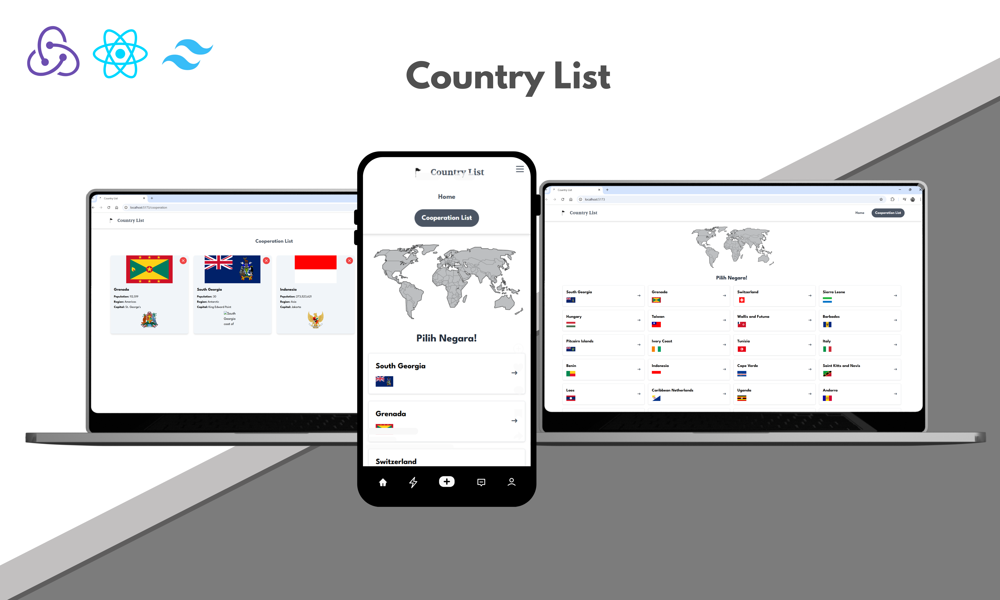

#### 👌 <i>Muhammad Syaiful Rahman</i> 👌 

## Live Preview
- Link : [Country List - Iful Rahman](https://iful-country-list.vercel.app/) 

## Screenshots (Preview)

<p align="center">
  
</p>

## Notes
✔ Responsive website (Desktop and mobile views) <br>
✔ Utilizing a state management library and git <br>
✔ The project is public and deployed.

## Menus
✔ Country List Page <br>
✔ Country Detail Page <br>
✔ Country Cooperation List Page

## Technology
- HTML, CSS, JavaScript
- React.js + Vite
- React Router
- Tailwind CSS
- Redux <br>
  etc.

## Installation

To run this project locally, follow these steps:

1. Download this project from this repository:

   ```bash
   Download Zip Folder

   ```

3. Open project with code editor and open terminal

2. Install the dependencies:

   ```bash
   npm install

   ```

3. Start the development server:

   ```bash
   npm run dev

   ```

4. Open your browser and navigate to localhost

# React + Vite

This template provides a minimal setup to get React working in Vite with HMR and some ESLint rules.

Currently, two official plugins are available:

- [@vitejs/plugin-react](https://github.com/vitejs/vite-plugin-react/blob/main/packages/plugin-react/README.md) uses [Babel](https://babeljs.io/) for Fast Refresh
- [@vitejs/plugin-react-swc](https://github.com/vitejs/vite-plugin-react-swc) uses [SWC](https://swc.rs/) for Fast Refresh


# React + Vite

This template provides a minimal setup to get React working in Vite with HMR and some ESLint rules.

Currently, two official plugins are available:

- [@vitejs/plugin-react](https://github.com/vitejs/vite-plugin-react/blob/main/packages/plugin-react/README.md) uses [Babel](https://babeljs.io/) for Fast Refresh
- [@vitejs/plugin-react-swc](https://github.com/vitejs/vite-plugin-react-swc) uses [SWC](https://swc.rs/) for Fast Refresh
